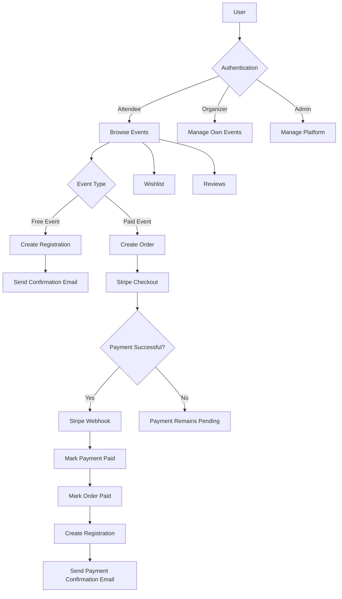

# 🎟️ Event Management System API

A production-oriented **Event Management REST API** built with **ASP.NET Core 8**.

The system models the complete lifecycle of an event platform: users discover events, organizers publish and manage events, attendees register for free events or purchase tickets for paid events, payments are processed through Stripe, and users can review and save events to a wishlist.

---

## 📌 Business Overview

The platform connects three main types of users:

- **Attendee** — discovers events, registers for free events, purchases paid events, manages orders/registrations, reviews events, and maintains a wishlist.
- **Organizer** — creates and manages their own events and monitors registrations for those events.
- **Admin** — manages users, roles, categories, events, registrations, and platform-level data.

The core business idea is:

> **An event can be free or paid. Free events use direct registration, while paid events use an Order → Stripe Payment → Registration workflow.**

This separation is important because a paid event should not be considered successfully booked until payment has actually been confirmed.

---

# 🎯 Main Business Flow



---

# 👥 User Roles

## 1. Attendee

An attendee is the customer/user who wants to attend events.

### Capabilities

- Register an account
- Confirm email
- Login
- Refresh access token
- Reset password
- Browse events
- Search events
- Filter events by category
- Sort and paginate events
- View upcoming events
- Register for free events
- Create orders for paid events
- Pay through Stripe
- View personal orders
- Cancel pending orders
- View personal registrations
- Cancel/delete own registration
- Add events to wishlist
- Remove events from wishlist
- Create reviews
- Update own reviews
- Delete own reviews
- View reviews for an event

---

## 2. Organizer

An organizer is responsible for creating and managing events.

### Capabilities

- Create events
- Upload event images
- Update own events
- Cancel own events
- Delete events
- View own events
- View registrations for their events
- View event-related data

Organizers cannot manage another organizer's events.

---

## 3. Admin

The admin represents the platform owner/administrator.

### Capabilities

- Manage users
- Delete users
- Create/update/delete categories
- Manage roles
- Assign roles to users
- Remove roles
- View all registrations
- View all orders
- View event orders
- Manage platform-level data

---

# 📖 User Stories

## 👤 Attendee User Stories

### Authentication

- As an attendee, I want to register with my name, email, age, and password so that I can use the platform.
- As an attendee, I want to receive an email confirmation so that my account can be verified.
- As an attendee, I want to login and receive an access token and refresh token so that I can securely access protected endpoints.
- As an attendee, I want to refresh my access token without logging in again.
- As an attendee, I want to reset my forgotten password through email.

### Event Discovery

- As an attendee, I want to browse all available events so that I can find something interesting.
- As an attendee, I want to search events by name so that I can quickly find a specific event.
- As an attendee, I want to browse events by category so that I can discover events related to my interests.
- As an attendee, I want to sort and paginate events so that large numbers of events remain easy to browse.
- As an attendee, I want to see upcoming events so that I can plan what I want to attend.

### Free Event Registration

- As an attendee, I want to register for a free event directly without making a payment.
- As an attendee, I want to receive a confirmation email after successful registration.
- As an attendee, I want to see all of my registrations.
- As an attendee, I want to cancel/delete my own registration.

### Paid Event Purchase

- As an attendee, I want to create an order for a paid event.
- As an attendee, I want to be redirected to Stripe Checkout so that I can pay securely.
- As an attendee, I want my order to become paid only after Stripe confirms the payment.
- As an attendee, I want my registration to be created automatically after successful payment.
- As an attendee, I want to receive an email confirming my successful payment and registration.
- As an attendee, I want to see my previous orders.
- As an attendee, I want to cancel a pending order before payment.

### Wishlist

- As an attendee, I want to save an event to my wishlist so that I can come back to it later.
- As an attendee, I want to view my wishlist.
- As an attendee, I want to remove an event from my wishlist.

### Reviews

- As an attendee, I want to rate an event and leave a comment.
- As an attendee, I want to edit my own review.
- As an attendee, I want to delete my own review.
- As a user, I want to read reviews for an event before deciding whether to attend it.

---

# 🧑‍💼 Organizer User Stories

- As an organizer, I want to create an event with a name, date, location, category, description, price, capacity, and image.
- As an organizer, I want to upload an event image so that the event has a visual representation.
- As an organizer, I want to update my event information.
- As an organizer, I want to cancel an event when it can no longer take place.
- As an organizer, I want to view all events that I created.
- As an organizer, I want to see the attendees registered for one of my events.
- As an organizer, I want the system to prevent me from modifying events that are already completed or canceled.

---

# 🛡️ Admin User Stories

- As an admin, I want to view all users so that I can manage the platform.
- As an admin, I want to delete users when necessary.
- As an admin, I want to create and manage event categories.
- As an admin, I want to create roles.
- As an admin, I want to assign roles to users.
- As an admin, I want to remove roles from users.
- As an admin, I want to view all registrations.
- As an admin, I want to view all orders.
- As an admin, I want to inspect orders associated with a specific event.

---

# 💰 Free vs Paid Events

The system intentionally handles free and paid events differently.

## Free Event

```text
Attendee
   ↓
Register
   ↓
Validate Event
   ↓
Validate Capacity
   ↓
Create Registration
   ↓
Send Confirmation Email
```

A free event does **not** require an Order or Payment.

## Paid Event

```text
Attendee
   ↓
Create Order
   ↓
Pending Order
   ↓
Create Stripe Checkout Session
   ↓
Stripe Payment
   ↓
Stripe Webhook
   ↓
Payment = Paid
   ↓
Order = Paid
   ↓
Create Registration
   ↓
Send Confirmation Email
```

The Stripe webhook is the final source of truth for successful payment rather than trusting the frontend redirect.

---

# 📋 Core Business Rules

The API contains business validations to protect the event lifecycle.

### Event rules

- A deleted event cannot be booked.
- A canceled event cannot be booked.
- A completed event cannot be booked.
- An event that has already occurred cannot be registered for.
- A completed event cannot be canceled.
- A canceled event cannot be canceled again.
- A completed event cannot have its status changed.
- A canceled event cannot have its status changed.
- An event can have a maximum attendee limit.
- Registration is rejected when the event reaches its maximum capacity.

### Registration rules

- A user cannot register for the same event more than once.
- Free events can be registered for directly.
- Paid events cannot use the direct free-registration endpoint.
- Users can only delete their own registrations.
- Organizers/Admins can inspect registrations according to their authorization level.

### Order rules

- Orders can only be created for paid events.
- Canceled events cannot receive orders.
- Completed events cannot receive orders.
- Past events cannot receive orders.
- A user cannot create another order when they already have a pending order for the same event.
- A user cannot create an order if they are already registered.
- Orders cannot be deleted after payment.
- Paid orders cannot be canceled.
- Only the owner of an order can manage it.

### Payment rules

- Only pending orders can be paid.
- Only the order owner can initiate payment.
- An order cannot have more than one payment.
- Stripe webhook confirmation changes the payment to `Paid`.
- Stripe webhook confirmation changes the order to `Paid`.
- Successful payment automatically creates the registration.
- Payment confirmation is idempotent: an already-paid payment is not processed again.

---

# 🔄 Event Lifecycle

```text
Scheduled
   │
   ├──────────────→ Canceled
   │
   └──────────────→ Completed
```

The API protects invalid transitions such as:

```text
Completed → Scheduled    ❌
Completed → Canceled     ❌
Canceled  → Scheduled    ❌
Canceled  → Completed    ❌
```

---

# 📦 Main Domain Entities

```text
ApplicationUser
    │
    ├── Events
    ├── Registrations
    ├── Orders
    ├── Reviews
    ├── Wishlists
    └── RefreshTokens

Event
    │
    ├── Category
    ├── Organizer
    ├── Registrations
    ├── Orders
    ├── Reviews
    └── Wishlists

Order
    │
    ├── User
    ├── Event
    └── Payment

Registration
    ├── User
    └── Event

Review
    ├── User
    └── Event

Wishlist
    ├── User
    └── Event
```

---

# 🏗️ Architecture

The project is organized into three main layers:

```text
Presentation Layer
        ↓
Business Logic Layer
        ↓
Data Access Layer
        ↓
SQL Server
```

## Presentation Logic Layer

Responsible for:

- Controllers
- HTTP endpoints
- Authentication/authorization pipeline
- Swagger
- Middleware

## Business Logic Layer

Responsible for:

- Business rules
- Services
- DTOs
- Mapping
- Exceptions
- Email notifications
- Payment logic
- Image upload logic

## Data Access Layer

Responsible for:

- EF Core
- SQL Server
- Entities
- Repository pattern
- Unit of Work
- Specifications
- Database configurations
- Migrations

---

# 🧩 Design Patterns & Practices

The project uses several backend patterns/practices:

- **Dependency Injection**
- **Repository Pattern**
- **Unit of Work**
- **Specification Pattern**
- **DTO Pattern**
- **Service Layer**
- **AutoMapper**
- **ASP.NET Core Identity**
- **JWT Authentication**
- **Refresh Tokens**
- **Role-Based Authorization**
- **Global Middleware / Exception Handling**
- **Pagination**
- **Searching & Sorting**
- **Entity Framework Core**
- **Soft Delete concepts**
- **External service integration**

---

# 🔐 Authentication & Authorization

Authentication is based on:

- ASP.NET Core Identity
- JWT Access Tokens
- Refresh Tokens
- Email Confirmation
- Role-Based Authorization

### Roles

```text
Admin
Organizer
Attendee
```

Protected endpoints use role-based authorization to ensure that users can only perform operations allowed for their role.

---

# 💳 Stripe Integration

The payment system uses **Stripe Checkout**.

### Payment lifecycle

```text
Pending Order
     ↓
Checkout Session
     ↓
Stripe
     ↓
Webhook
     ↓
Payment.Paid
     ↓
Order.Paid
     ↓
Registration Created
```

The Stripe webhook is responsible for confirming the transaction and completing the business operation.

---

# 📧 Email Notifications

The application sends emails for important user actions, including:

- Email confirmation
- Password reset
- Free event registration confirmation
- Successful paid-event payment
- Registration confirmation after payment

---

# 🖼️ Image Upload

Event images are uploaded through **Cloudinary**.

When an event image is replaced, the previous Cloudinary asset can also be removed so that unused images do not remain indefinitely.

---

# 🔎 Event Discovery

Events support:

- Search
- Category filtering
- Sorting
- Pagination
- Upcoming events
- Event details
- Organizer's own events

This allows the API to scale better than returning every event in a single response.

---

# 📡 Main API Modules

| Module | Responsibility |
|---|---|
| `Account` | Registration, login, confirmation, password reset, tokens |
| `Role` | Role creation and assignment |
| `Event` | Event discovery and management |
| `Category` | Event categories |
| `Registration` | Free-event registration |
| `Order` | Paid-event order lifecycle |
| `Payment` | Stripe checkout and webhook |
| `Review` | Event reviews |
| `Wishlist` | Saved events |
| `Notification` | Email notifications |

---

# 🛠️ Technology Stack

### Backend

- C#
- ASP.NET Core 8 Web API
- Entity Framework Core 8
- ASP.NET Core Identity
- SQL Server

### Authentication

- JWT Bearer Authentication
- Refresh Tokens
- Role-Based Authorization

### Integrations

- Stripe
- Cloudinary
- SMTP/Email Service

### Development

- Swagger / OpenAPI
- AutoMapper
- Repository Pattern
- Unit of Work
- Specification Pattern

---

# 🚀 Getting Started

## 1. Clone the repository

```bash
git clone <https://github.com/MohamedEssam-2/Event-Management-System>
cd Event-Management-System
```

## 2. Configure the application

Configure the required settings in the application configuration/user secrets.

Typical configuration sections include:

```json
{
  "ConnectionStrings": {
    "DefaultConnection": "YOUR_SQL_SERVER_CONNECTION_STRING"
  },
  "JwtOptions": {
    "Key": "YOUR_SECRET_KEY",
    "Issuer": "YOUR_ISSUER",
    "Audience": "YOUR_AUDIENCE"
  },
  "Stripe": {
    "SecretKey": "YOUR_STRIPE_SECRET_KEY",
    "WebhookSecret": "YOUR_STRIPE_WEBHOOK_SECRET",
    "SuccessUrl": "YOUR_SUCCESS_URL",
    "CancelUrl": "YOUR_CANCEL_URL"
  },
  "ServerSettings": {
    "BaseUrl": "YOUR_API_BASE_URL"
  }
}
```

Do **not** commit real secrets, API keys, Stripe keys, passwords, or production connection strings to GitHub.

## 3. Apply database migrations

```bash
dotnet ef database update
```

## 4. Run the API

```bash
dotnet run
```

Swagger is enabled for API exploration and testing.

---

# 🧪 Recommended Demo Scenario

A good way to demonstrate the complete business workflow is:

### Scenario 1 — Free Event

1. Register an attendee.
2. Confirm the email.
3. Login.
4. Browse events.
5. Select a free event.
6. Register.
7. Check `MyRegistrations`.
8. Verify the confirmation email.

### Scenario 2 — Paid Event

1. Login as an attendee.
2. Browse a paid event.
3. Create an order.
4. Create a Stripe checkout session.
5. Complete payment in Stripe.
6. Stripe calls the webhook.
7. Verify:
   - Payment = `Paid`
   - Order = `Paid`
   - Registration created
8. Verify payment confirmation email.

### Scenario 3 — Organizer

1. Login as an organizer.
2. Create an event.
3. Upload an image.
4. Update event details.
5. View `MyEvents`.
6. View registrations for the event.
7. Cancel the event when required.

### Scenario 4 — Admin

1. Login as admin.
2. View users.
3. Manage categories.
4. Manage roles.
5. Inspect registrations and orders.

---

# 📊 Project Structure

```text
Event-Management-System/
│
├── Business-Logic-Layer/
│   ├── DTO/
│   ├── Exceptions/
│   ├── Mapping/
│   └── Service/
│
├── Data-Access-Layer/
│   ├── Database/
│   │   ├── Configurations/
│   │   ├── DbContext/
│   │   └── Migrations/
│   ├── Models/
│   ├── Repository/
│   ├── Specifications/
│   └── Enum/
│
└── Presentation-Logic-Layer/
    ├── Controllers/
    ├── Middleware/
    └── Program.cs
```

---

# 🎯 What This Project Demonstrates

This project is designed to demonstrate more than basic CRUD.

It focuses on **real backend business logic**, including:

- Multi-role authorization
- Authentication lifecycle
- Event lifecycle management
- Capacity management
- Free vs paid business flows
- Order lifecycle
- Payment processing
- Stripe webhook handling
- Automatic registration after payment
- Email notifications
- Reviews and wishlists
- Search, sorting and pagination
- Repository + Unit of Work
- Specification-based querying
- External service integration
- Validation and business-rule enforcement
- Separation between API, business logic, and data access

---

# 📌 Project Status

The core event-management, authentication, registration, review, wishlist, order, payment, email notification, image upload, authorization, and persistence flows are implemented.

The project is intended as a backend-focused portfolio project demonstrating how a real event platform can be modeled and implemented with ASP.NET Core.

---

## 👨‍💻 Author

**Mohamed Essam**

Backend .NET Developer

Built with **ASP.NET Core 8 • EF Core • SQL Server • Stripe • Cloudinary**
